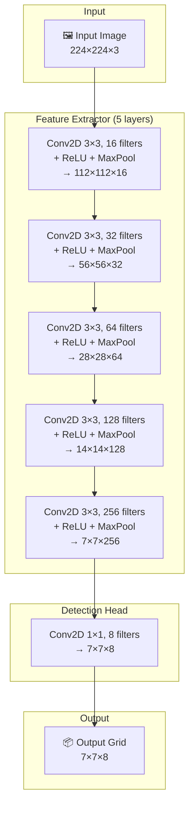
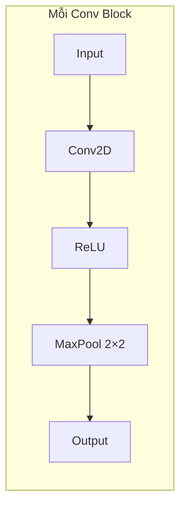
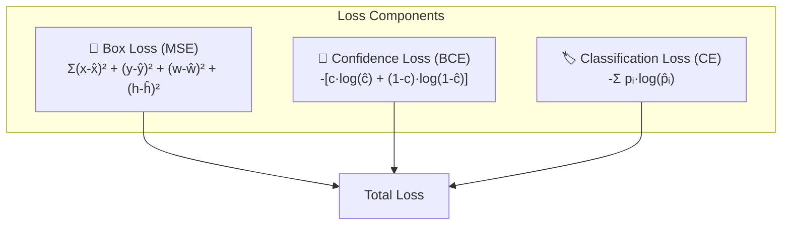
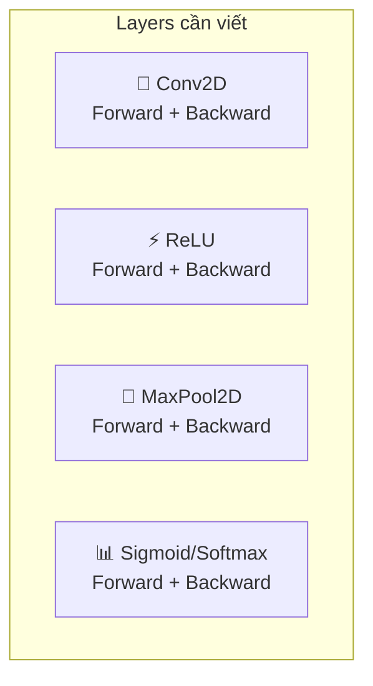

# Simple Object Detector - Kiến Trúc Đơn Giản

## Mục Tiêu
- Nhận diện **3 loại vật thể** kích thước vừa
- **Dễ implement** bằng NumPy với các lớp tự định nghĩa
- **Có thể huấn luyện** trong thời gian hợp lý
- Ưu tiên **sự đơn giản** hơn độ chính xác

---

## Kiến Trúc Đề Xuất: Simple Grid Detector



---

## Chi Tiết Output: 7×7×8

Mỗi cell trong grid 7×7 dự đoán **1 bounding box** với format:

```
[x, y, w, h, confidence, class1, class2, class3]
 ↑  ↑  ↑  ↑      ↑         ↑       ↑       ↑
 │  │  │  │      │         └───────┴───────┴── Class probabilities (3 classes)
 │  │  │  │      └── Confidence có object (0-1)
 │  │  │  └── Height (relative to cell)
 │  │  └── Width (relative to cell)
 │  └── Y offset trong cell (0-1)
 └── X offset trong cell (0-1)
```

**Tổng parameters per cell**: 4 (box) + 1 (conf) + 3 (classes) = **8**

---

## Bảng Tổng Kết Các Lớp

| Layer | Input Size | Output Size | Kernel | Stride | Params |
|-------|-----------|-------------|--------|--------|--------|
| Conv1 | 224×224×3 | 112×112×16 | 3×3 | 1 | 448 |
| Conv2 | 112×112×16 | 56×56×32 | 3×3 | 1 | 4,640 |
| Conv3 | 56×56×32 | 28×28×64 | 3×3 | 1 | 18,496 |
| Conv4 | 28×28×64 | 14×14×128 | 3×3 | 1 | 73,856 |
| Conv5 | 14×14×128 | 7×7×256 | 3×3 | 1 | 295,168 |
| Conv6 | 7×7×256 | 7×7×8 | 1×1 | 1 | 2,056 |
| **Total** | | | | | **~395K** |

> [!TIP]
> Chỉ ~395K parameters - rất nhỏ so với YOLOv8n (3.2M params)!

---

## Forward Pass Flow



---

## Loss Function (Đơn giản)

```
Total Loss = λ_coord × Box Loss + Confidence Loss + Classification Loss
```



---

## So Sánh Độ Phức Tạp

| Aspect | YOLOv8 | Simple Detector |
|--------|--------|-----------------|
| Parameters | 3.2M+ | ~395K |
| Layers | 100+ | 6 |
| Anchors | Multiple | None (1 box/cell) |
| FPN/PANet | Yes | No |
| C2f/Bottleneck | Yes | No |
| Custom ops | Many | Conv, ReLU, MaxPool only |
| Training time | Hours | Minutes |

---

## Các Lớp Cần Implement

Chỉ cần **4 loại lớp cơ bản**:



---

## Pseudo-code Kiến Trúc

```python
class SimpleDetector:
    def __init__(self, num_classes=3):
        self.num_classes = num_classes
        
        # Feature Extractor
        self.conv1 = Conv2D(in_channels=3, out_channels=16, kernel_size=3, padding=1)
        self.conv2 = Conv2D(in_channels=16, out_channels=32, kernel_size=3, padding=1)
        self.conv3 = Conv2D(in_channels=32, out_channels=64, kernel_size=3, padding=1)
        self.conv4 = Conv2D(in_channels=64, out_channels=128, kernel_size=3, padding=1)
        self.conv5 = Conv2D(in_channels=128, out_channels=256, kernel_size=3, padding=1)
        
        # Detection Head (5 = 4 box + 1 conf, 3 = num_classes)
        self.conv6 = Conv2D(in_channels=256, out_channels=5+num_classes, kernel_size=1)
        
        # Activation & Pooling
        self.relu = ReLU()
        self.pool = MaxPool2D(kernel_size=2, stride=2)
    
    def forward(self, x):
        # x: (batch, 224, 224, 3)
        
        x = self.pool(self.relu(self.conv1(x)))  # -> (batch, 112, 112, 16)
        x = self.pool(self.relu(self.conv2(x)))  # -> (batch, 56, 56, 32)
        x = self.pool(self.relu(self.conv3(x)))  # -> (batch, 28, 28, 64)
        x = self.pool(self.relu(self.conv4(x)))  # -> (batch, 14, 14, 128)
        x = self.pool(self.relu(self.conv5(x)))  # -> (batch, 7, 7, 256)
        
        x = self.conv6(x)  # -> (batch, 7, 7, 8)
        
        # Apply activations
        # Box coords (x,y,w,h): sigmoid for 0-1 range
        # Confidence: sigmoid
        # Classes: softmax
        
        return x
```

---

## Kế Hoạch Huấn Luyện

1. **Data**: ~100-500 ảnh cho mỗi class (tổng 300-1500 ảnh)
2. **Augmentation**: Flip horizontal, small rotation
3. **Batch size**: 8-16
4. **Learning rate**: 0.001 với decay
5. **Epochs**: 50-100
6. **Optimizer**: SGD với momentum

> [!IMPORTANT]
> Với kiến trúc này, bạn hoàn toàn có thể tự implement và huấn luyện bằng NumPy trong thời gian hợp lý!
